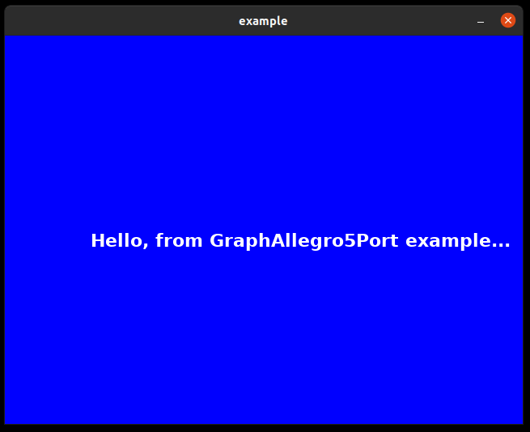

# GraphAllegro5PortPascal
Multiplatform (DOS, M$, UNIX/*BSD, Linux, Mac OS X, iOS, and Android) port  for "Graph" Turbo Pascal graphic library based on "Allegro5" graphic library.

## Motivation
I fond on my archive disks some older Pascal sources, from times when I learned Turbo Pascal on IBM PC machines in 90' :-)
Based on facts, that all my programs in Pascal were created at school time and I had a huge fun with Pascal learning, I decided to write port for Graph library to run my Turbo Pascal older programs on Linux OS.

```c
   █████████                                █████        █████████   ████  ████                                       ██████████ ███████████                      █████    ███████████                                       ████ 
  ███▒▒▒▒▒███                              ▒▒███        ███▒▒▒▒▒███ ▒▒███ ▒▒███                                      ▒███▒▒▒▒▒▒█▒▒███▒▒▒▒▒███                    ▒▒███    ▒▒███▒▒▒▒▒███                                     ▒▒███ 
 ███     ▒▒▒  ████████   ██████   ████████  ▒███████   ▒███    ▒███  ▒███  ▒███   ██████   ███████ ████████   ██████ ▒███     ▒  ▒███    ▒███  ██████  ████████  ███████   ▒███    ▒███  ██████    █████   ██████   ██████   ▒███ 
▒███         ▒▒███▒▒███ ▒▒▒▒▒███ ▒▒███▒▒███ ▒███▒▒███  ▒███████████  ▒███  ▒███  ███▒▒███ ███▒▒███▒▒███▒▒███ ███▒▒███▒█████████  ▒██████████  ███▒▒███▒▒███▒▒███▒▒▒███▒    ▒██████████  ▒▒▒▒▒███  ███▒▒   ███▒▒███ ▒▒▒▒▒███  ▒███ 
▒███    █████ ▒███ ▒▒▒   ███████  ▒███ ▒███ ▒███ ▒███  ▒███▒▒▒▒▒███  ▒███  ▒███ ▒███████ ▒███ ▒███ ▒███ ▒▒▒ ▒███ ▒███▒▒▒▒▒▒▒▒███ ▒███▒▒▒▒▒▒  ▒███ ▒███ ▒███ ▒▒▒   ▒███     ▒███▒▒▒▒▒▒    ███████ ▒▒█████ ▒███ ▒▒▒   ███████  ▒███ 
▒▒███  ▒▒███  ▒███      ███▒▒███  ▒███ ▒███ ▒███ ▒███  ▒███    ▒███  ▒███  ▒███ ▒███▒▒▒  ▒███ ▒███ ▒███     ▒███ ▒███ ███   ▒███ ▒███        ▒███ ▒███ ▒███       ▒███ ███ ▒███         ███▒▒███  ▒▒▒▒███▒███  ███ ███▒▒███  ▒███ 
 ▒▒█████████  █████    ▒▒████████ ▒███████  ████ █████ █████   █████ █████ █████▒▒██████ ▒▒███████ █████    ▒▒██████ ▒▒████████  █████       ▒▒██████  █████      ▒▒█████  █████       ▒▒████████ ██████ ▒▒██████ ▒▒████████ █████
  ▒▒▒▒▒▒▒▒▒  ▒▒▒▒▒      ▒▒▒▒▒▒▒▒  ▒███▒▒▒  ▒▒▒▒ ▒▒▒▒▒ ▒▒▒▒▒   ▒▒▒▒▒ ▒▒▒▒▒ ▒▒▒▒▒  ▒▒▒▒▒▒   ▒▒▒▒▒███▒▒▒▒▒      ▒▒▒▒▒▒   ▒▒▒▒▒▒▒▒  ▒▒▒▒▒         ▒▒▒▒▒▒  ▒▒▒▒▒        ▒▒▒▒▒  ▒▒▒▒▒         ▒▒▒▒▒▒▒▒ ▒▒▒▒▒▒   ▒▒▒▒▒▒   ▒▒▒▒▒▒▒▒ ▒▒▒▒▒ 
                                  ▒███                                                    ███ ▒███                                                                                                                                
                                  █████                                                  ▒▒██████                                                                                                                                 
                                 ▒▒▒▒▒                                                    ▒▒▒▒▒▒                                                                                           
```

### How to start?
- FPC (Free Pascal Compiler) is installed on Linux OS
- Allegro5 developers bindings are already installed in Linux OS
- this repository is cloned to local Linux machine
- call `make` and run `example` program

#### Example commands from Linux Ubuntu/Debian
```bash
$ sudo apt install fpc
$ sudo apt install liballegro5-dev
$ make
$ ./example
```

#### What you can see?
It will be new window with blue background and in mid of screen you can see text message - it means, that example.pas and Graph port library compiled on your Linux machine.



## Additional sources
- [Allegro5 library reference manual](https://liballeg.org/a5docs/trunk/index.html)
- [Allegro5 C library sources](https://github.com/liballeg/allegro5)
- [Allegro5 Pascal wrapper](https://github.com/niuniomartinez/allegro-pas)

## TODO List
- [X] add first impl. and example program for DetectGraph and InitGraph procedures/functions
- [ ] - [ ] add impl. for typical graphics primitives like Line, Bar, Ract and others
- [ ] create and test CI for FPC example compiling
- [ ] add all graphics primitives demos in example program
- [ ] create instruction how to port any older program written in Turbo/Borland Pascal and Graph library
